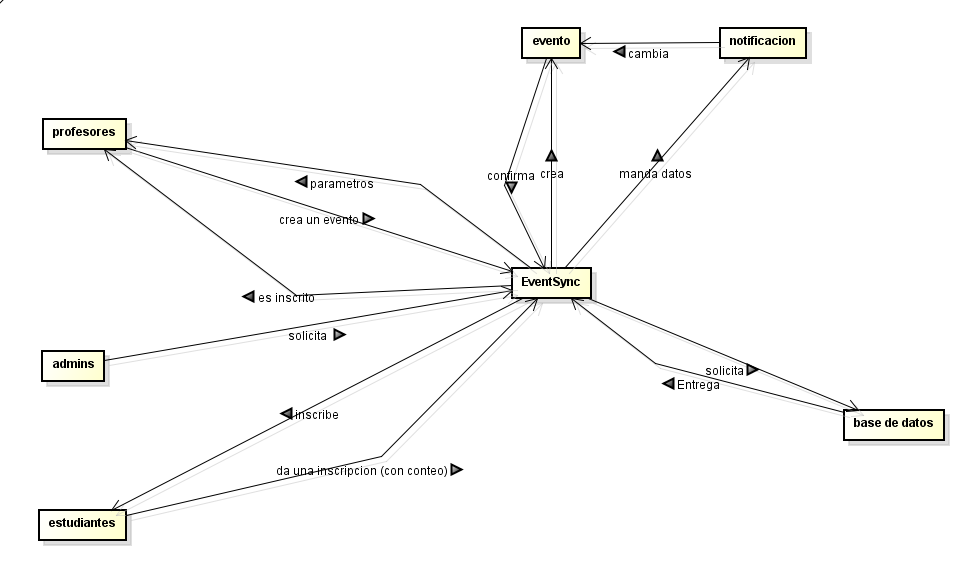
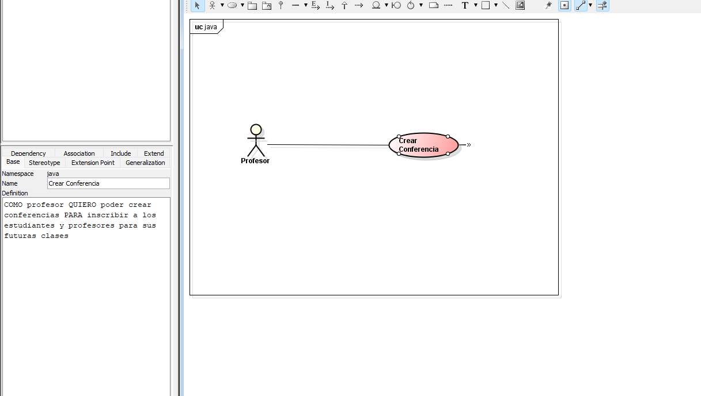
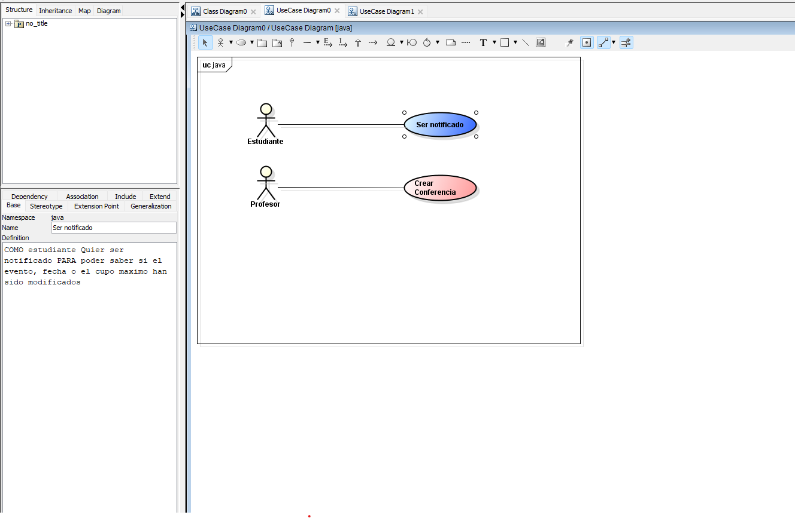

## 1. Realice el diagrama de contexto con las generalidades de su sistema.

## 2.Identifique 2 patrones de diseño que puedan aplicarse al caso de estudio,
especificando por cada uno:

## Primer patron 

a. Nombre del Patrón:
Factory method 

b. Tipo de patrón (creacional). 

c. Justificación de la decisión:
usaremos este patron ya que como contamos con 3 diferentes eventos (conferencia taller y hackaton)
cada uno con sus propias reglas de creacion ademas de que factory method permite que cada subclase decida como crear
sus reglas y seguir sus eventos sin que tengamos que acoplar codigo es indicado para este problema

## Segundo patron

a. Nombre del Patrón:
Observer

b. Tipo de patrón (comportamiento).

c. Justificación de la decisión

ya que el sistema debe notificar a todos los inscritos automaticamente cuando ocurre algo en el evento
encajando con lo que hace observer ya que es un patron de diseño hecho para notificar a varios usuarios
sobre cualquier evento que suceda 

## 3. Identifique 5 requerimientos del sistema y clasifíquelos en funcionales (3) y no funcionales (2). Garantiza que al menos un requerimiento funcional seleccionado utilice un patrón identificado. (Añadirlo al README.md)

## requerimiento 1 

REQUERIMIENTO FUNCIONAL 1: 

Creacion de eventos por tipo (Conferencia, Taller, Hackathon) y por sus reglas lo cual es lo que definimos anteriormente con Factory 
se debe aceptar (duracion, creador, campos requeridos)

Requerimiento FUNCIONAL 2:

El sistema debe permitir inscribir estudiantes y profesores a eventos validando los siguientes parametros:

correo que termine en @escuelaing.edu.co, su cupo y la fecha 

Requerimiento FUNCIONAL 3: 

Se debe notificar a todos los inscritos teniendo en cuenta las condiciones 

evento : confirmado - cancelado / fecha modificada, cupo maximo 

Requerimiento no funcional 1:

Validacion de correo institucional que termine en @escuelaing.edu.co

Requerimiento no funcional 2:

Validacion de formato que sea idEnlace_nombre_correo_programa 

## 4. Del listado anterior, seleccione los 2 requerimientos funcionales más importantes del sistema y desarrolle un diagrama de casos de uso con su respectiva historia de usuario. Garantiza que al menos un requerimiento funcional seleccionado utilice un patrón identificado. (Añadirlo al README.md)

requerimientos funcionales escogidos (1 y 3):

## 6.  Seleccione un requerimiento asociado al patrón y realice la descomposición de tareas asociadas: Épica - Historia de Usuario - Al menos 3 tareas. (Añadirlo al README.md)

### 1. Epica 
Implementar sistema de notificaciones automaticas para inscritos en EventSync

## 2. Historia Usuario 
como Profesor quiero recibir notificaicones para esta informado de mi trabajo 

## 3 Tareas

1. Implementar la interfaz Observer
2. Implementar la clase Inscrito como Observer
3. Implementar método notifyObservers() en Evento.
4. Integrar notificaciones al cambiar estado o fecha
5. Probar notificaciones en el método Main

## 1. Epica 
Crear un sistema que maneje eventos debe permitir manejar la logica de los 3 tipos de evento 

## Hisotria de Usuario 
como Usuario quiero recibir las notifaciones para poder estar al pendiente de mis actividades 

## 7. Realice un diagrama de clases que permita entender su solución. Mencione, ¿cuáles principios SOLID está aplicando? ¿Y por qué?

los principios solid adiquiridos son:

## Principios SOLID Aplicados

- **Single Responsibility Principle (SRP):**  
  Cada clase tiene una nica responsabilidad .

- **Open/Closed Principle:**  
  Se pueden agregar nuevos tipos de evento sin modificar la lógica existente.

- **Liskov Substitution Principle (LSP):**  
  Conferencia, Taller y Hackathon pueden usarse como Evento sin alterar el comportamiento esperado.

  ## 8. Desarrolle en código su solución; en el método main plantee una entrada y salida que valide el correcto funcionamiento.
