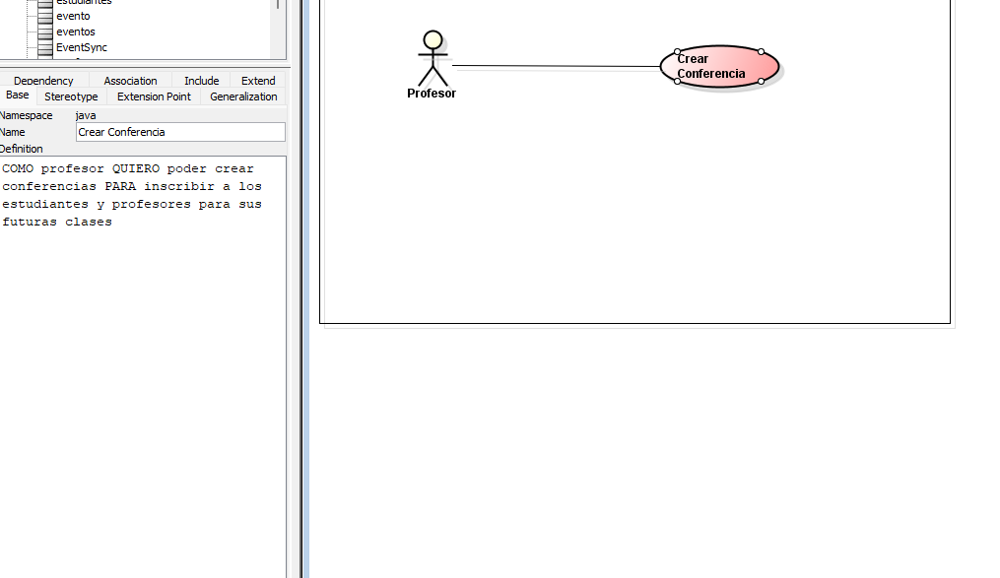
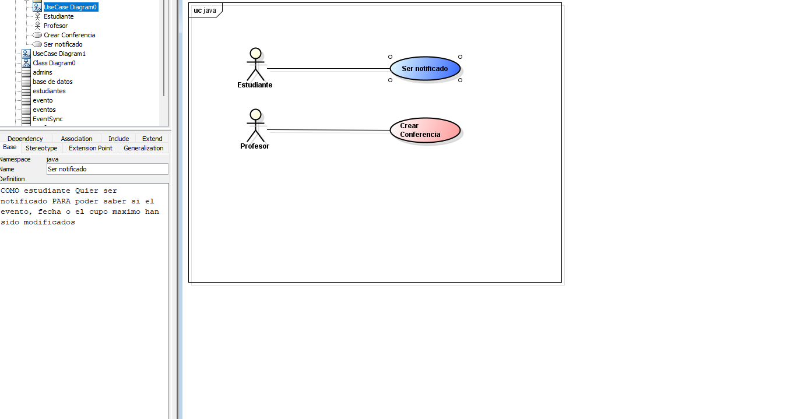

# 📄 Requerimientos del Sistema

## 1. Lista general de requerimientos

El sistema de Bankify tiene los siguientes requerimientos (descripción a alto nivel):

### 1.1 Requerimientos funcionales

El sistema de  debe tener la capacidad de:

1. Creacion de eventos por tipo (Conferencia, Taller, Hackathon)
2.
3. notificar a todos los inscritos teniendo en cuenta las condiciones
4.
5.

### 1.2 Requerimientos funcionales

El sistema de Bankify debe tener:
1.
2.
3.
4.
5.

## 2. Diagramas de caso de uso

### 2.1 Requerimiento Funcional 1

| Campo | Descripción                                                                                                                                                                                                                                                                                                                                                    |
|------|----------------------------------------------------------------------------------------------------------------------------------------------------------------------------------------------------------------------------------------------------------------------------------------------------------------------------------------------------------------|
| **ID** | RF-01                                                                                                                                                                                                                                                                                                                                                          |
| **Nombre del requerimiento** | Creacion de eventos                                                                                                                                                                                                                                                                                                                                            |
| **Descripción** | *El sistema debe permitir inscribir estudiantes y profesores *                                                                                                                                                                                                                                                                                                 |
| **Precondiciones** | *correo que termine en @escuelaing.edu.co, su cupo y la fecha hora de inicio cupo maximo y nombre*                                                                                                                                                                                                                                                             |
| **Actor** | *Profesor o Administrador*                                                                                                                                                                                                                                                                                                                                     |
| **Flujo principal** | 1. El profesor o Administrador crea el evento con su  título, fecha/hora inicio, duración, cupo máximo, nombre del conferencista ->  Eventsync valida las condiciones por medio de una base de datos -> la base de datos le devuelve la informacion a EventSync ya con la info se ve si fue rechazada sisi  -> EventSync crea el evento-> envia la notifiacion 
                                                                                                                                         |
| **Diagrama de caso de uso** |                                                                                                                                                                                                                                                                                                                                            |
| **Poscondiciones** | *Se espera que el procesor o administrador pueda crear el evento y los estudiantes sean inscritos*                                                                                                                                                                                                                                                             |

### 2.2 Requerimiento Funcional 2

| Campo | Descripción                                                                                                                                                                                                                                                                  |
|------|------------------------------------------------------------------------------------------------------------------------------------------------------------------------------------------------------------------------------------------------------------------------------|
| **ID** | RF-02                                                                                                                                                                                                                                                                        |
| **Nombre del requerimiento** |                                                                                                                                                                                                                                                                              |
| **Descripción** | *El sistema debe Se debe notificar a todos los inscritos teniendo en cuenta las condiciones *                                                                                                                                                                                |
| **Precondiciones** | *verificar los cupos el id el correo *                                                                                                                                                                                                                                       |
| **Actor** | *EventSync*                                                                                                                                                                                                                                                                  |
| **Flujo principal** | 1. EventSync recibe una solicitud-> EventSync accede a la base de datos -> EventSync recibe una confirmacion con esos datos y crea un evento o niega la solicitud, envia un estado boolean a notificaciones dependiendo del evento-> notifcaciones propaga a todos los datos |
| **Diagrama de caso de uso** |                                                                                                                                                                                                                                                              |
| **Poscondiciones** | *Se espera como resultado que todos los miembros sean notificados *                                                                                                                                                                                                          |

